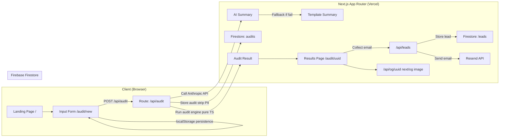

# ARCHITECTURE.md — Model-meter System Design

## System Diagram

## Data Flow

**Input → Audit → Result:**

1. User fills `/audit/new` form (localStorage persisted, no server involved)
2. User submits → `POST /api/audit` with `{ teamSize, useCase, tools[] }`
3. Server validates with Zod, runs `runAudit()` (pure TypeScript, no AI)
4. Server calls Anthropic API for 100-word summary (8s timeout, template fallback)
5. Server generates UUID, writes to Firestore `audits` collection (PII-free)
6. Client redirects to `/audit/{uuid}`
7. Results page is a Server Component that reads Firestore by UUID
8. User optionally submits email → `POST /api/leads` → Firestore `leads` + Resend email

## Stack Justification

| Component | Choice | Why |
|---|---|---|
| Framework | Next.js 15 App Router | OG images via `next/og`, SSR results page, route handlers, one-click Vercel deploy |
| Language | TypeScript strict | Audit engine type safety — silent calculation bugs are disqualifying |
| Styling | Tailwind + shadcn UI | Radix UI accessibility primitives, zero runtime CSS overhead |
| Database | Firebase Firestore | No credit card for Spark plan, Admin SDK bypasses security rules for clean server-only writes |
| AI | Anthropic claude-haiku-4-5 | 100-word summaries don't need Sonnet reasoning; 5x cheaper, faster |
| Email | Resend | Cleanest Next.js integration, 3K free emails/month |
| OG Images | next/og (ImageResponse) | Built into Next.js, zero extra infrastructure |
| Form state | localStorage | Multi-tool form is too complex for URL params |
| Validation | Zod | TypeScript-first, shared between client and server |
| Testing | Vitest | Native ESM, compatible with Next.js 15 |
| Rate limiting | In-memory Map | Sufficient for MVP; see scale-up note below |

## Security Design

**PII isolation:** The `audits` Firestore collection never contains email, company name, or role. These are only in the `leads` collection. Public routes (`/audit/[uuid]`) only read from `audits`. Firestore Security Rules enforce this at the database layer.

**Abuse protection:**
- Honeypot field (`website`) on the lead capture form — silently discarded if non-empty
- Rate limiting: `/api/audit` — 10 per IP per hour; `/api/leads` — 3 per IP per hour

**No secrets in client code:** All API keys in server-side env vars only. Firebase client config (`NEXT_PUBLIC_*`) is safe to expose — it's authentication-less by design with Security Rules.

## What Would Change at 10K Audits/Day

| Current Limitation | Scale-Up Solution |
|---|---|
| In-memory rate limiter doesn't work across Vercel instances | Upstash Redis (`@vercel/kv`) — one env var change |
| OG images generated on-demand per request | Add `immutable` cache header (already done) + Vercel Edge Cache |
| Firestore reads on every results page load | React `cache()` or ISR with `revalidate: 3600` |
| Per-audit Anthropic API call adds latency | Queue with Inngest or async generation |
| Firestore Spark free tier (20K writes/day) | Upgrade to Blaze plan — still very cheap |
| `firebase-admin` cold start on Vercel | Pre-initialize in a shared module (already done via singleton) |

At 10K audits/day, the application architecture is otherwise sound. Vercel handles horizontal scaling automatically.
