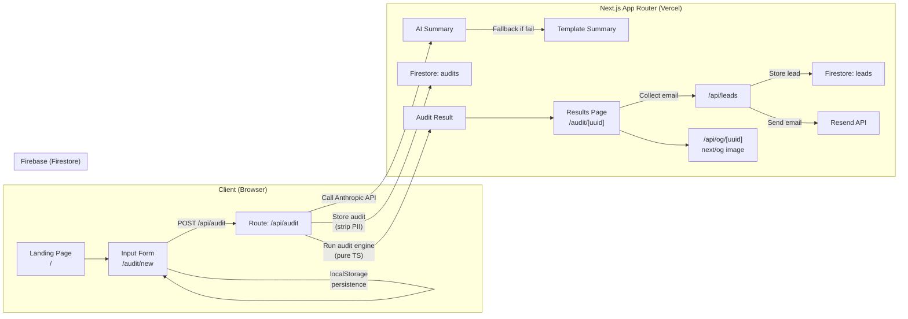

# DESIGN_DOC.md — Model-meter Architecture & Design

> This doubles as the basis for the required ARCHITECTURE.md in the repo root. The repo's ARCHITECTURE.md should be a condensed version of sections 1–4 with the Mermaid diagram.

---

## 1. System Architecture



**Key architecture decisions:**
- The audit engine runs entirely server-side in the `/api/audit` route. This keeps pricing logic out of the browser (no client-side pricing table to inspect/game).
- Firestore is used for two separate collections: `audits` (public-safe, no PII) and `leads` (PII, never queried by public routes).
- AI summary is generated in the same API call as the audit, but failures do not block the audit response.
- OG images are generated on-demand by a separate route handler, not stored.

---

## 2. Page-by-Page Flow

### `/` — Landing Page

**Purpose:** Convert a cold visitor into someone who fills out the form.

**Content:**
- Hero: headline + subheadline + CTA button
- 2–3 sentence explainer of what the tool does
- Social proof block (can be mocked for MVP, labelled as such)
- No form on this page — single CTA to `/audit/new`

**Technical:** Static page, no server-side data fetching needed. Fast.

---

### `/audit/new` — Input Form

**Purpose:** Collect spend data.

**Form structure:**
```
Global section:
  - Team size (number input)
  - Primary use case (select: coding / writing / data / research / mixed)

Per-tool section (repeatable, one card per tool):
  - Tool name (select from supported list)
  - Plan (dynamic based on tool selection)
  - Monthly spend (number, USD)
  - Number of seats (number)
  - [+ Add another tool] button

[Run My Audit] CTA button
```

**State management:**
- Form state stored in `localStorage` under key `model-meter-form-v1`
- On mount: hydrate from localStorage
- On any change: write to localStorage (debounced 300ms)
- On submit: POST to `/api/audit`, then redirect to `/audit/[uuid]`

**Why localStorage, not URL params:** Multi-tool form state is too large and nested for clean URL params. URL params are fine for single-field filters, not for a form with 8 tools × 3 fields each.

**Validation:**
- At least one tool selected
- Monthly spend must be ≥ 0
- Seats must be ≥ 1 for seat-based plans
- API-direct plans: seats field hidden, spend field required

---

### `/audit/[uuid]` — Results Page

**Purpose:** Deliver value. This is the page that gets shared.

**Sections (in order):**

1. **Hero:** "You could save **$X/month** ($Y/year)" — large, bold, immediately visible above the fold
2. **AI Summary paragraph** (or template fallback) — personalized, ~100 words
3. **Per-tool breakdown table/cards:**
   - Tool name + current plan
   - Current monthly spend
   - Recommended action
   - Projected savings
   - One-sentence reason
4. **Credex CTA** (shown conditionally if total savings > $500/mo):
   - "Get these savings today — book a Credex consultation"
   - Brief explanation of what Credex does
5. **"You're already optimized" block** (shown if savings < $100/mo):
   - Honest, specific message
   - "Notify me when new optimizations apply to your stack" signup
6. **Email capture form** (always shown, below value):
   - Email (required)
   - Company name (optional)
   - Role (optional)
   - Team size (optional)
   - Privacy note
7. **Share button** — copies the current URL, shows a toast

**Public URL behavior:**
- This page is publicly accessible by UUID
- No email, company name, or role shown — only tools, plans, savings numbers, and recommendations
- The email capture form is shown but submitting it from a shared link creates a new lead attributed to "viewer" context, not the original audit owner

---

### `/api/audit` — POST Route Handler

**Input (request body):**
```typescript
{
  teamSize: number;
  useCase: "coding" | "writing" | "data" | "research" | "mixed";
  tools: Array<{
    toolId: string;        // e.g. "cursor", "github-copilot"
    planId: string;        // e.g. "pro", "business"
    monthlySpend: number;  // user-entered USD
    seats: number;
  }>;
}
```

**Server-side steps:**
1. Validate input schema (zod)
2. Run audit engine → produces findings array
3. Generate UUID for this audit
4. Call Anthropic API for summary (with timeout + try/catch)
5. Write to Firestore `audits` collection (public-safe subset only)
6. Return response: `{ auditId: uuid, findings: [...], summary: string, totalMonthlySavings: number }`

**Output (response body):**
```typescript
{
  auditId: string;
  totalMonthlySavings: number;
  totalAnnualSavings: number;
  findings: Array<{
    toolId: string;
    toolName: string;
    currentPlan: string;
    currentMonthlySpend: number;
    recommendedAction: string;  // "downgrade" | "switch" | "upgrade" | "optimal"
    recommendedPlan?: string;
    projectedMonthlySavings: number;
    reason: string;  // one sentence
  }>;
  summary: string;  // AI-generated or template fallback
  summaryIsAI: boolean;  // for debugging; not shown to user
}
```

**Client after response:** Redirect to `/audit/[auditId]`. Do not store full audit in localStorage after submission — fetch from Firestore on the results page.

---

### `/api/leads` — POST Route Handler

**Input:**
```typescript
{
  auditId: string;
  email: string;
  companyName?: string;
  role?: string;
  teamSize?: number;
  honeypot?: string;  // must be empty string to pass
}
```

**Server-side steps:**
1. Check honeypot field — if non-empty, return 200 silently (do not log, do not store)
2. Rate limit: max 3 submissions per IP per hour (use Vercel KV or simple in-memory Map — see TECH_STACK.md)
3. Validate email format
4. Write to Firestore `leads` collection
5. Call Resend API to send transactional email
6. Return `{ success: true }`

**Email content:**
- Subject: "Your Model-meter AI Spend Audit"
- Body: confirms total savings found, lists top 2 recommendations, note that Credex will reach out if savings > $500/mo
- Plain text + HTML versions

---

### `/api/og/[uuid]` — Dynamic OG Image Route

**Purpose:** Generate the link preview image that appears when the audit URL is shared.

**Implementation:** `next/og` (ImageResponse)

**Design:**
- Dark background, white text
- Model-meter logo/wordmark top-left
- Large: "This audit found **$X,XXX/year** in potential savings"
- Small: top 2 tools with savings
- "model-meter.vercel.app" watermark bottom right

**Caching:** Add `Cache-Control: public, max-age=86400` — OG images don't change after audit is created.

---

## 3. Audit Engine Design

The engine is the most important piece of code in this project. It must be:
- Deterministic (same input → same output always)
- Traceable (every savings figure has a named rule that produced it)
- Conservative (never over-claim savings; round down)
- Honest (output "optimal" if it is genuinely optimal)

### Engine Structure

```typescript
// audit-engine/index.ts
export function runAudit(input: AuditInput): AuditResult {
  const findings = input.tools.map(tool => evaluateTool(tool, input));
  return aggregateFindings(findings);
}

function evaluateTool(tool: ToolInput, context: AuditContext): ToolFinding {
  const rules = getRulesForTool(tool.toolId);
  const applicableRules = rules.filter(r => r.applies(tool, context));
  const bestRule = selectHighestSavingsRule(applicableRules);
  return bestRule ? bestRule.apply(tool, context) : optimalFinding(tool);
}
```

### Rule Categories

**1. Plan-Fit Rules** (same vendor, right-sizing)

| Rule ID | Trigger | Action | Savings Logic |
|---------|---------|--------|---------------|
| `plan-fit-sub5-cursor` | Cursor Business, seats < 5 | Downgrade to Pro ($20/seat) | `(business_price - pro_price) × seats` |
| `plan-fit-sub5-claude` | Claude Team, seats < 5 | Downgrade to Pro ($20/seat) | `(team_price - pro_price) × seats` |
| `plan-fit-sub5-chatgpt` | ChatGPT Business, seats < 5 | Downgrade to Plus ($20/seat) | `(business_price - plus_price) × seats` |
| `plan-fit-gh-copilot-biz-small` | GH Copilot Business, seats ≤ 2 | Downgrade to Pro ($10/seat) | `(biz_price - pro_price) × seats` |
| `plan-fit-solo-on-team` | Any team plan, seats = 1 | Downgrade to individual plan | delta × 1 |

**2. Redundancy Rules** (cross-tool)

| Rule ID | Trigger | Action | Savings Logic |
|---------|---------|--------|---------------|
| `redundant-chatgpt-claude` | Both ChatGPT Plus ($20) AND Claude Pro ($20) for same use case | Consolidate to one (recommend based on use case) | $20/month |
| `redundant-cursor-windsurf` | Both Cursor AND Windsurf (same seats) | Drop Windsurf if use case is coding | lower_price |
| `redundant-claude-gh-copilot-coding` | Claude Pro + GH Copilot Pro for coding | Recommend Cursor Business instead (includes Claude + GPT4) | calculate delta |

**3. Upgrade-to-Save Rules** (avoid metered overages)

| Rule ID | Trigger | Action | Savings Logic |
|---------|---------|--------|---------------|
| `overage-cursor-pro-to-pro-plus` | Cursor Pro, user-entered spend > $40/month | Upgrade to Pro+ ($60) to get 3x credits | `user_spend - 60` if positive |

**4. Use-Case Fit Rules** (wrong tool for the job)

| Rule ID | Trigger | Action | Savings Logic |
|---------|---------|--------|---------------|
| `use-case-api-data-task` | API direct (Anthropic/OpenAI flagship), use case = data | Recommend Gemini Flash API ($0.10/$0.40/M) | estimate from spend |
| `use-case-chatgpt-pro-200-coding` | ChatGPT Pro ($200), use case = coding | Recommend Cursor Business ($40/seat) | delta × seats |

**5. Enterprise Scaling Warning** (not a savings rule, a risk flag)

| Rule ID | Trigger | Action |
|---------|---------|--------|
| `scale-warning-claude-team-150` | Claude Team, seats approaching 150 | Warn: "Enterprise transition will change pricing structure significantly. Book a Credex consultation before you scale past 150 seats." |

### Pricing Data Module

```typescript
// audit-engine/pricing.ts
// ALL numbers here must match PRICING_DATA.md exactly.
// Source URL and verification date are required comments for each.

export const PRICING: Record<string, PricingTable> = {
  cursor: {
    hobby:    { monthly: 0,   type: 'individual' },
    pro:      { monthly: 20,  type: 'individual' },
    'pro-plus': { monthly: 60, type: 'individual' },
    ultra:    { monthly: 200, type: 'individual' },
    business: { monthly: 40,  type: 'per-seat', minSeats: 1 },
  },
  // ... all other tools
};
```

### Conservative Savings Calculation

- Never claim savings on a plan that is already at the lowest tier for its use case
- When user-entered spend ≠ expected plan price, use user-entered spend as the baseline (they may have negotiated pricing or be in an annual plan)
- Annual savings = monthly savings × 12 (simple, no compound)
- If savings < $5/month, do not surface as a recommendation (noise)

---

## 4. Shareable URL Design

**URL format:** `/audit/[uuid]` where UUID is a `crypto.randomUUID()` v4 generated server-side at audit creation time.

**Firestore `audits` collection schema (public-safe):**
```
audits/{uuid}
  createdAt: Timestamp
  useCase: string
  teamSize: number
  tools: Array<{ toolId, planId, seats, monthlySpend }>
  findings: Array<{ toolId, currentPlan, recommendedAction, projectedSavings, reason }>
  totalMonthlySavings: number
  totalAnnualSavings: number
  summary: string
  // NO: email, companyName, role — these are ONLY in leads collection
```

**Firestore `leads` collection schema (private):**
```
leads/{leadId}
  auditId: string   // FK to audits collection
  email: string
  companyName?: string
  role?: string
  teamSize?: number
  createdAt: Timestamp
  savings: number   // denormalized for quick filtering
  highSavings: boolean  // savings > 500
```

**PII guarantee:** The public `/audit/[uuid]` page only fetches from the `audits` collection. It never queries `leads`. This is enforced by Firestore Security Rules (see INSTRUCTIONS.md).

---

## 5. Lead Capture Design

**Placement:** The email capture form appears on the results page, BELOW the audit findings. The user must see their results before being asked for their email.

**Copy framing:**
- If savings > $500: "Save this report + unlock your Credex consultation"
- If savings $100–$500: "Get this report emailed to you"
- If savings < $100: "Get notified when new optimizations apply to your stack"

**Required fields:** Email only. Everything else optional.

**Post-submission state:**
- Form replaced by a success message: "Report sent! Check your inbox."
- No redirect. User stays on results page.
- Share URL still works.

**Transactional email (Resend):**
```
Subject: Your Model-meter AI Audit Results
From: audit@model-meter.com (or noreply@)

Body:
  - Total savings found: $X/month
  - Top 2 recommendations (brief)
  - Link back to their audit: [URL]
  - If highSavings: "A Credex advisor will be in touch within 1 business day to help you capture these savings through discounted AI credits."
  - If not: "We'll reach out when new optimizations become available for your stack."
```

---

## 6. AI Summary Flow

```
1. Audit engine runs → produces findings array + totals
2. Build prompt (see PROMPTS.md)
3. Call Anthropic API:
   - Model: claude-haiku-4-5 (cheapest, sufficient for 100-word summary)
   - max_tokens: 200
   - timeout: 8 seconds
4. On success: use response text as summary
5. On failure (any exception, timeout, or non-200):
   - Log error server-side
   - Use template: "Your current AI configuration has a potential saving of $[monthly]/month ($[annual]/year). 
     The biggest opportunity is [top_tool]: [top_reason]. [If savings > 0: 'Optimizing your [top_tool] 
     subscription alone could save your team $[top_savings]/month.'] [If Credex CTA: 'Credex can help 
     you capture these savings through discounted AI credits.']"
6. summaryIsAI flag set accordingly (used for internal logging only, not shown to user)
```

**Why Haiku, not Sonnet?** 100-word summaries don't require Sonnet-level reasoning. Haiku is faster, cheaper, and still produces perfectly good prose for this use case.

---

## 7. Error Handling

| Scenario | Behavior |
|----------|----------|
| Anthropic API fails | Use template summary. No visible error. Log internally. |
| Firestore write fails on audit creation | Return 500, show user-facing error: "Something went wrong. Try again." Don't redirect. |
| Firestore read fails on results page | Show error state with "Reload" button. |
| Lead submission fails | Show error: "Couldn't save your email. Try again." Don't lose the results page state. |
| Resend email fails | Log error. Don't return 500 to client — lead is stored even if email fails. |
| UUID not found | 404 page with "This audit doesn't exist. Start a new one →" link. |
| Form submission with 0 tools | Client-side validation blocks submission. |
| Rate limit hit | Return 429 with message: "Too many requests. Try again in an hour." |

---

## 8. Security & Privacy

**No secrets in the repo.** All API keys in environment variables only:
- `ANTHROPIC_API_KEY`
- `RESEND_API_KEY`
- `NEXT_PUBLIC_FIREBASE_*` (public Firebase config — safe to expose)
- `FIREBASE_SERVICE_ACCOUNT` (server-side admin SDK only, base64-encoded JSON)

**Firestore Security Rules:**
```javascript
rules_version = '2';
service cloud.firestore {
  match /databases/{database}/documents {
    // Public audits: anyone can read, only server can write
    match /audits/{auditId} {
      allow read: if true;
      allow write: if false;  // Only writable via Admin SDK server-side
    }
    // Leads: completely private, server-only
    match /leads/{leadId} {
      allow read: if false;
      allow write: if false;
    }
  }
}
```

**Abuse protection:**
- Honeypot field: `<input name="website" type="text" style="display:none" tabindex="-1" />` — if non-empty, silently discard
- Rate limiting: `/api/leads` — max 3 requests per IP per hour using in-memory store (acceptable for MVP; upgrade to Redis/Upstash for production)
- `/api/audit` — max 10 audits per IP per hour

**PII handling:**
- Email and company name stored ONLY in `leads` collection
- `audits` collection never contains PII
- Public routes (`/audit/[uuid]`) only read from `audits`

---

## 9. Scalability Notes

> For the ARCHITECTURE.md "What would you change for 10K audits/day" section

Current design breaks at:
- **Audit volume:** In-memory rate limiter doesn't work across Vercel serverless instances → replace with Upstash Redis
- **OG image generation:** Currently on-demand per request → add Vercel Edge caching or pre-generate at audit creation
- **Firestore reads:** Results page hits Firestore on every load → add React cache() or ISR with `revalidate`
- **AI summary:** Per-audit Anthropic call → batch or queue with Bull/Inngest for high volume

For 10K audits/day, the Firestore free tier (20K writes/day) would need upgrading to Blaze plan. Everything else scales fine with Vercel's infrastructure.
